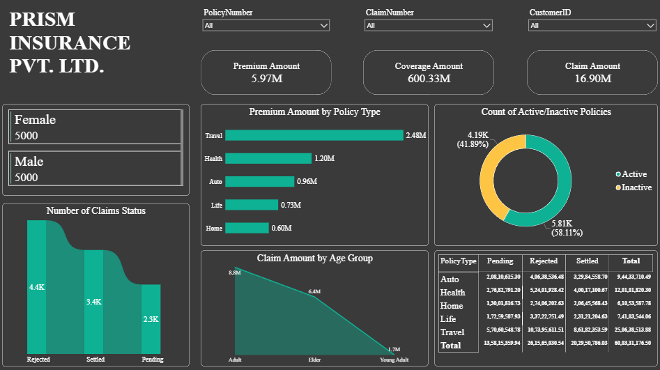
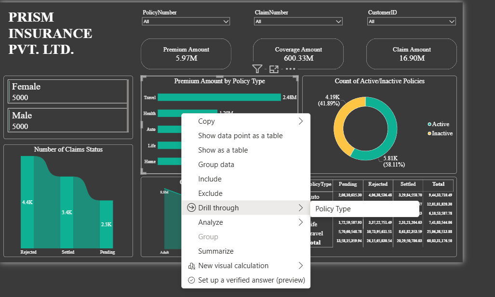
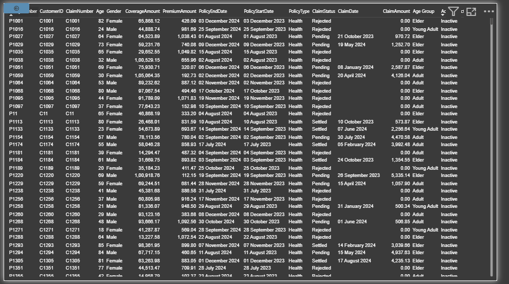
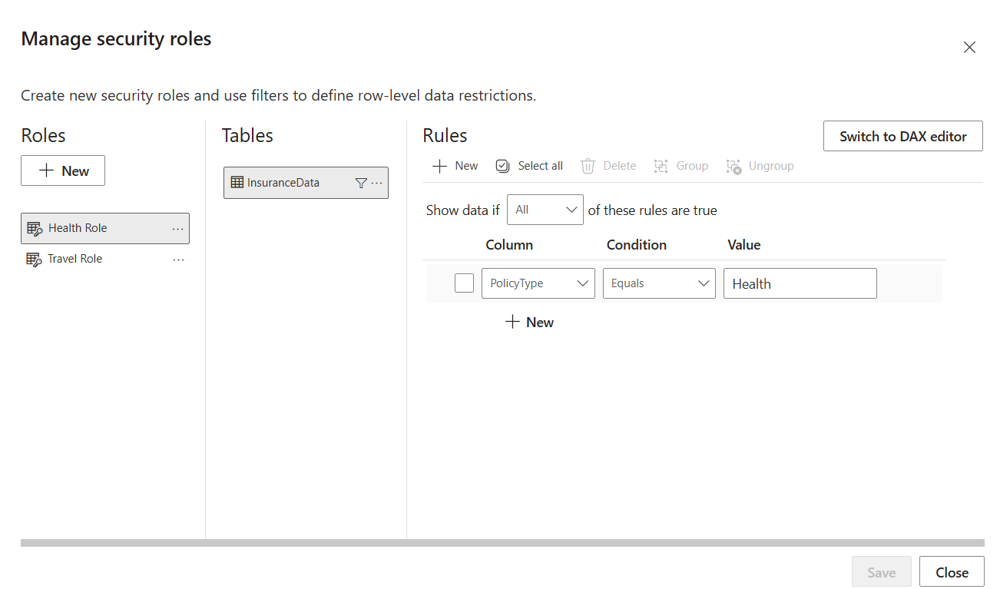

# Prism Insurance Dashboard | Power BI Project

## Overview

The **Prism Insurance Dashboard** is an interactive Business Intelligence solution developed using **Microsoft Power BI** to analyze insurance policies, claims, premiums, coverage amounts, and customer demographics.

The dashboard enables stakeholders to monitor policy performance, analyze claim trends, and make data-driven decisions through interactive visualizations, drill-through functionality, and Row-Level Security (RLS).

---

## Dashboard Preview

### Main Dashboard



The main dashboard provides an overview of:

* Total Premium Amount
* Total Coverage Amount
* Total Claim Amount
* Premium Distribution by Policy Type
* Active vs Inactive Policies
* Claim Status Analysis
* Claim Amount by Age Group

---

## Drill Through Functionality

### Drill Through Selection



The dashboard includes a Drill Through feature that allows users to navigate from summary-level visualizations to detailed policy records.

### Drill Through Result Page



Users can analyze policy-level information including:

* Policy Number
* Customer ID
* Claim Status
* Claim Amount
* Policy Type
* Coverage Amount
* Customer Demographics

---

## Row-Level Security (RLS)



To ensure secure access to sensitive insurance data, Row-Level Security (RLS) was implemented.

### Roles Created

#### Health Role

```DAX
[PolicyType] = "Health"
```

#### Travel Role

```DAX
[PolicyType] = "Travel"
```

This allows users to view only the data relevant to their assigned role.

---

## Dataset Information

The dataset contains approximately **10,000 insurance records** with the following fields:

* PolicyNumber
* CustomerID
* Gender
* Age
* Age Group
* PolicyType
* PolicyStartDate
* PolicyEndDate
* PremiumAmount
* CoverageAmount
* ClaimNumber
* ClaimDate
* ClaimAmount
* ClaimStatus
* Active/Inactive

---

## Key Features

* Interactive KPI Cards
* Dynamic Slicers
* Drill Through Reporting
* Premium Analysis
* Claims Analysis
* Age Group Analysis
* Policy Type Analysis
* Row-Level Security (RLS)
* DAX Measures

---

## Business Insights

* Travel policies generate the highest premium revenue.
* Active policies outnumber inactive policies.
* Adult customers contribute the highest claim amount.
* Claim status analysis helps identify settlement trends.

---

## Tools & Technologies

* Microsoft Power BI Desktop
* DAX (Data Analysis Expressions)
* Data Modeling
* Drill Through
* Row-Level Security (RLS)

---

## Project Structure

```text
Insurance_PowerBI_Report/
│
├── Images/
│   ├── Dashboard.png
│   ├── RLS.png
│   ├── drill_through_1.png
│   └── drill_through_2.png
│
├── Insurance_Report.pbix
│
└── README.md
```

---

## Author

**Sanki Susanta Pritam**

Aspiring Data Analyst | Power BI Developer

---

## Project Outcome

✔ Interactive Insurance Analytics Dashboard

✔ Drill Through Implementation

✔ Row-Level Security Configuration

✔ Claims and Premium Analysis

✔ Business Intelligence Reporting
